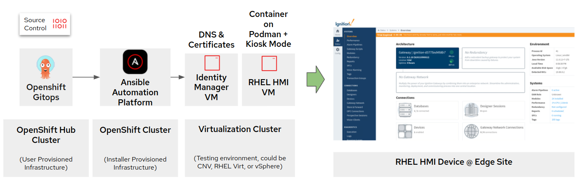

# Human Machine Interface for Edge Demo

## Description

This is a demo of a customer deployment of Inductive Automation Ignition application to RHEL Edge device including some of the external services required by the customer for security, logging and certification so the application can run in HTTPS mode in a completely disconnected environment.

## Status

This is a work in progress at this time. Currently the build of the Ansible Automation Platform, the VM and deployment of the application as a podman systemd service is fully functional. The IDM server deployment, creating certificate requests and assigning dns is still a work in progress as this was something that had a extremely short deadline to demo.



## Steps to install

1. Install OpenShift Gitops so we can use it to deploy Ansible Automation Platform.

    ```shell
    oc apply -k https://github.com/redhat-cop/gitops-catalog/openshift-gitops-operator/overlays/stable
    ```

2. Create Cluster Role Binding for gitops.

   ```shell
   oc create -f argo/argocd-clusterbindingrole.yaml
   ```

3. Install Ansible Automation Platform via OpenShift Gitops. This will do the following: create a service account, deploy the AAP operator, patch the operator, controller and add configurations for the URL using the patch operator to fully install Ansible Automation Platform.

    ```shell
    for f in  gitops/argocd/apps/aap-operator.yaml gitops/argocd/apps/aap-controller.yaml gitops/operators/patch-operator/subscription.yaml gitops/operators/patch-operator/rbac.yaml gitops/operators/patch-operator/operatorgroup.yaml gitops/argocd/apps/patch-operator.yaml gitops/aap/consolelink-patch.yaml gitops/aap/consolelink.yaml;do oc create -f $f;done
    ```

4. Retrieve web address and credentials to log into the Ansible Automation Platform console, and login.

    ```shell
    oc get routes -n ansible-automation-platform | awk {'print $2'} && echo Password: && oc get secrets/example-admin-password -n ansible-automation-platform -o json | jq '.data' |grep -v '{' |grep -v '}' |cut -d '"' -f4 | base64 -d && echo ''
    ```

    Example Output:

    ```shell
    HOST/PORT
    controller-ansible-automation-platform.apps.clustername
    Password:
    xxxxxxxxxxxxxxxxxxxxxxxxxxxxxxxx
    ```

4. Log in to controller in a web browser via the address in oc get route command below.

    ```shell
    oc get route -n ansible-automation-platform
    NAME       HOST/PORT                                                                      PATH   SERVICES           PORT   TERMINATION     WILDCARD
    hmi-demo   hmi-demo-ansible-automation-platform.apps.brooklyn.demo.red-chesterfield.com          hmi-demo-service   http   edge/Redirect   None
    ```

5. Once logged in you will be prompted for your cloud.redhat.com credentials to choose which subscription to use.

## Configuring Ansible Automation Platform

### Automated Method (WIP)

Configure everything via via <https://github.com/redhat-cop/tower_configuration>

A good example is at <https://github.com/ansible/workshops/tree/devel/roles/populate_controller>

### Manual method until we get the above configured

1. Create git credentials
2. Create virtualization credentials
3. Create inventory from virtualization provider
4. Create templates for each playbook
